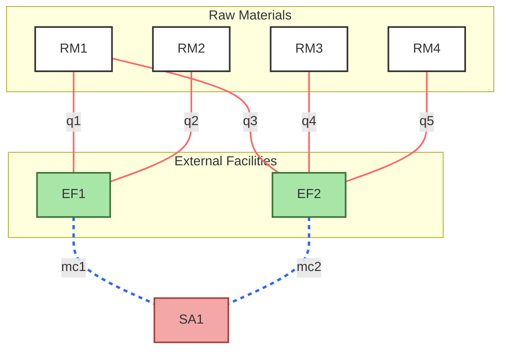
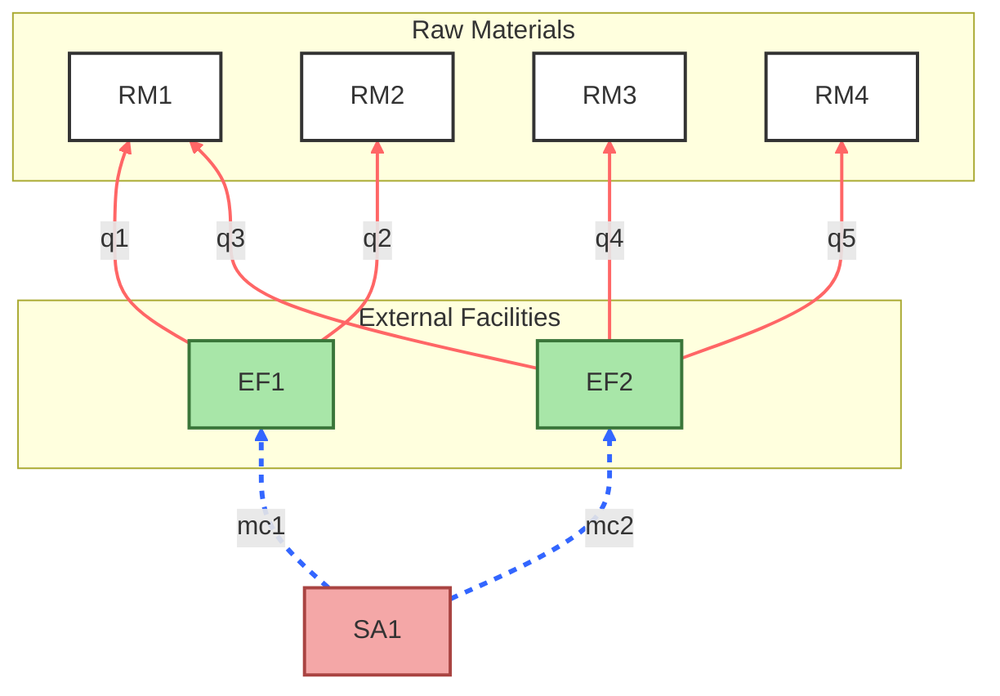

# Simulation

# Cost Propagation

My chain involves the 2 layer propagation: 

## 1. Raw materials to External facilities

The notion of defining the cost of external facilities is the cost of the required raw materials to meet the demand of the external facility (already calculated). In addition to the procurement raw materials there’s operational cost to the external facility. 

The approach taken to model the cost propagation is **to find the unit cost of the external facility (cost for a unit demand), then multiply it by the demand that is calculated**. For this we have the **edge attribute** quantity represented by `q` which is the unit quantity of raw materials required and unit cost of the raw material `c` as a **node attribute**.

<aside>

$$
Cost\ Ext.\ Fac_1 = fd_1 \ (q_1 * c_1 + q_2 * c_2) + op\ cost
$$

*(1)*

$$
Cost \ Ext.\ Fac_2 \ = \ fd_2 \ (q_3 * c_1 + q_4 * c_2 + q_5 * c_4) + op\ cost
$$

*(2)*

</aside>

## 2. External facilities to Subassembly parts

It is a design choice that multiple external facilities can give out a single type of sub assembly product, but an external facility cannot give out multiple sub assemblies. So, when we move the cost up the chain to the next layer, **we need to sum up the costs of the external facilities** that are providing the sub assembly. 

**We iterate through the edges that are flowing into any subassembly and add up their costs**, which results in propagation of cost to the subassembly parts. In this example, the cost of the subassembly `SA1` is the sum of the external facilities `EF1` and `EF2`. 

<aside>

$$
Cost\ SA_1 = (1) \ + \ (2)
$$

</aside>

# Demand Propagation

This part of the chain involves 2 layers of demand propagation:

## 1. Subassembly to External Facilities

The demand of any particular SA part is to be split across various external facilities that are providing it. But on what basis are we gonna split up the demand? 

The way we model it is to use the maximum capacity of the external facilities as the determining factor for the split of demand. The idea is to propagate the demand to the external facilities proportional to their maximum capacities. The external facility with greater max. capacity takes in more demand. 

<aside>

$$
Sum \ of\ max. \ capacities, \ S = mc_1 + mc_2
$$

$$
Demand \ Ext. \ Fac_1 = (d/S) * mc_1
$$

$$
Demand \ Ext. \ Fac_2 = (d/S) * mc_2
$$

</aside>

## 2. External Facilities to Raw Materials

The demand gives the number of raw materials required given the demand of the external facilities that are connected with the raw material part. We propagate the demand from the facility to the raw material by multiplying the quantity that is associated as edge attribute in the edges connecting the raw materials to the facility. 

As a single raw material part can be used by multiple external facilities, we do a summation of the demand from every facility. In this way, we’re able to propagate the demand and clearly deduce the number of parts specifically required on the production mode of the supply chain simulation. 

<aside>

$$
Demand \ rm_1 = Demand\ Ext.\ Fac_1 * q1 + Demand\ Ext.\ Fac_2 * q3
$$

$$
Demand\ rm_2 = Demand\ Ext.Fac_1 * q2
$$

$$
Demand \ rm_3 = Demand\ Ext.\ Fac_2 * q_4
$$

$$
Demand \ rm_4 = Demand\ Ext.\ Fac_2 * q_5
$$

</aside>

